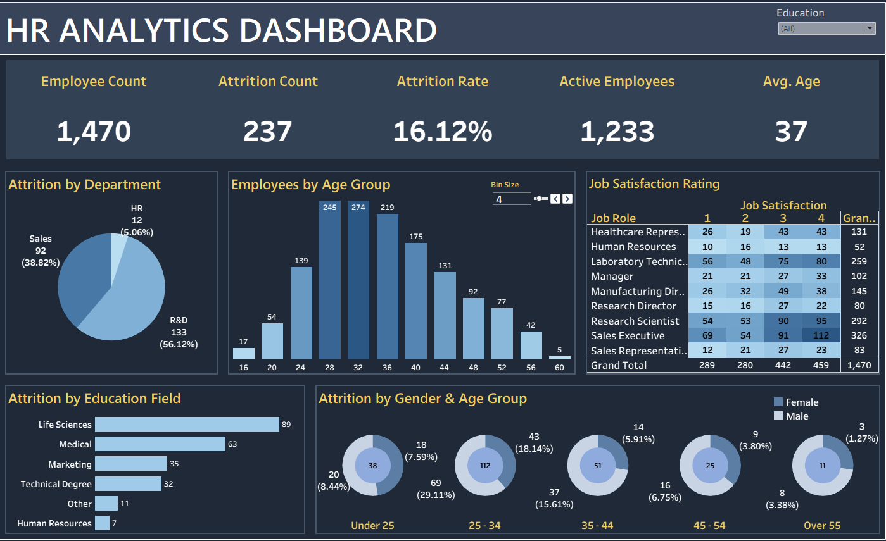

# HR Analytics Dashboard (Tableau)

## Project Overview

This interactive Tableau dashboard provides insights into workforce demographics, employee attrition, job satisfaction, and workforce composition. It enables HR teams and business leaders to monitor key workforce metrics and identify trends that may influence employee retention.

---

## Dashboard Preview



---

## Interactive Dashboard

🔗 **[View Live Dashboard on Tableau Public](https://public.tableau.com/views/HRAnalyticsDashboard_17862916255380/HRANALYSISDASHBOARD)**

---

## Business Questions Answered

- What is the overall employee attrition rate?
- Which departments experience the highest attrition?
- Which education fields have the highest employee turnover?
- How does employee distribution vary across age groups?
- How does job satisfaction differ across job roles?
- How does attrition vary by age group and gender?

---

## Key KPIs

- Employee Count
- Active Employees
- Attrition Count
- Attrition Rate
- Average Employee Age

---

## Dashboard Features

- Interactive Education filter
- Adjustable Age Bin parameter
- Dynamic KPI cards
- Department-wise attrition analysis
- Employee age distribution
- Job Satisfaction heatmap
- Attrition analysis by education field
- Attrition by gender across age groups

---

## Tools Used

- Tableau Public
- Microsoft Excel

---

## Dataset

The dashboard uses the HR dataset included in this repository.

Location:

```
data/HR Data.xlsx
```

---

## Files Included

```
HR_Analytics_Dashboard.twbx
```

Packaged Tableau Workbook

```
data/
```

Dataset

```
images/
```

Dashboard screenshots

---

## Skills Demonstrated

- Dashboard Design
- Data Visualization
- Interactive Filtering
- Parameters
- Calculated Fields
- KPI Design
- Data Storytelling
- HR Analytics
